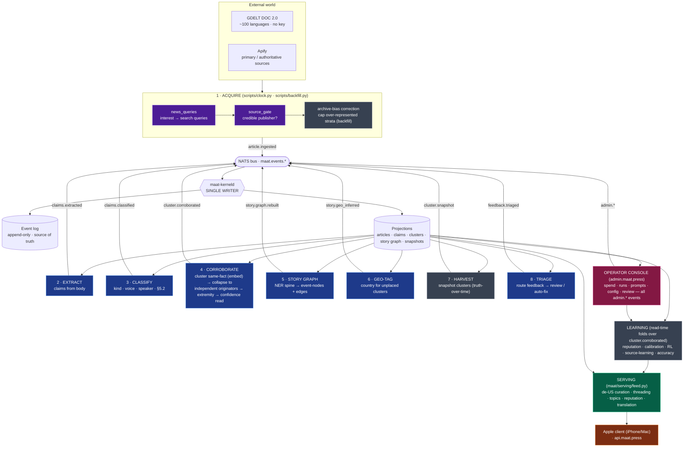

# Maat — the pipeline, end to end

> A personal, continuous news feed that ranges across the open web, assesses **how well each story
> corroborates** rather than how widely it spreads, and serves it with a **confidence read**
> attached. It weights away from a US-centric slant, spans English, Portuguese, and French sources,
> and reads natively on iPhone and Mac. Quality takes priority over cost throughout.

This document explains how a URL on the open web becomes a confidence-scored, threaded, de-slanted
story on someone's phone — and how the system learns whether it was right over time.

---

## 1. The big idea

Most feeds rank by **engagement** (how widely a claim spreads). Maat ranks by **corroboration**
(how many *independent* originators assert the same fact) and **truth over time** (whether claims
later confirm or get refuted). Four principles shape everything below:

1. **Corroboration, not consensus.** A fact is strong when *independent* sources converge on it —
   not when one wire story is reprinted 500 times. Collapsing reprints/cascades/co-owned outlets to
   their true originators is the heart of the veracity read (§5.5).
2. **Extraordinary claims need extraordinary evidence.** Every claim carries a prior; the
   corroboration needed to clear it rises with the claim's distance from that prior (§5.6).
3. **Truth over time.** History has an answer key — claims later confirm or get refuted. Reputation
   and calibration are *folds over that trajectory*, never a snapshot count (§6).
4. **De-slant.** Archives and wires over-represent English-language majors; the feed actively
   re-ranks for geographic/source diversity and corrects archive bias on backfill.

---

## 2. Architecture at a glance

Maat is **event-sourced**. Nothing mutates state directly. Instead:

```
agents / console  ──publish──▶  NATS bus  ──▶  maat-kerneld  ──fold──▶  Postgres
   (Python)                  (maat.events.*)   (Rust, SINGLE WRITER)    (event log + projections)
                                                                              │
   serving / console  ◀────────────────────read projections────────────────┘
```

- **Event log** (`events` table, append-only) is the **source of truth**. Every fact the system
  knows is a replayable consequence of events.
- **`maat-kerneld`** (Rust) is the **single writer**. It subscribes to `maat.events.*`, decodes each
  envelope, and folds it into read-model **projections** (`articles`, `claims`, `clusters`, the story
  graph, …). One writer ⇒ no write races, and the log *is* the audit trail for free.
- **Agents** (Python) are stateless batch passes: read projections → compute → publish events. They
  never write the DB directly.
- **Provider seam** (`maat/providers/seam.py`) is the only door to an LLM. It exposes three calls —
  `claude_complete` (judge), `mistral_complete` (bulk), `mistral_embed` (embeddings) — so the model
  is selectable per call and the rest of the code is provider-agnostic.

### Model routing (who runs on what)

| Role | Calls | Model |
|---|---|---|
| **Judge default** (`CLAUDE_JUDGE`) | acquisition query-gen, source-credibility gate, console assistant | **Opus 4.8** |
| **Veracity pipeline** | extract, classify, extremity | **Sonnet 4.6** |
| **Assist paths** | story-graph NER, feedback triage, geo-tagging, topic enrichment | **Sonnet 4.6** |
| **Embeddings** | same-fact clustering, story-graph similarity | **mistral-embed** |

> No call runs on Haiku. The pipeline stages pin their own model; only the low-volume "judge"
> default is Opus (it's cheap at that volume). `extremity` is deliberately kept on Sonnet because it
> fires once per cluster per tick — Opus there would be ~$80/day on the uncapped clock. See
> [`docs/prompt-template.md`](prompt-template.md) for how in-app prompts are *structured*.

---

## 3. The whole flow



Every box that publishes an event routes through the **same** `bus → kernel → log + projections`
loop — the arrows to `BUS` are drawn once per stage to keep it readable, but they all converge on the
single writer.

---

## 4. Stage by stage

Each stage is a pure-ish batch pass: **read projections → compute → publish events**. The clock runs
them in order (§5); each can also be run standalone (`make <target>`).

### 1 · Acquire — `scripts/clock.py`, `scripts/backfill.py`, `maat/acquire/*`
Find real articles for the tracked topics and ingest their bodies.
- **`news_queries`** (Opus) turns a natural-language interest ("West African politics") into a few
  *news* search queries — searching the literal interest pulls SEO/listicle junk.
- **GDELT DOC 2.0** is the broad, global, key-less, ~100-language stream; **Apify** is a per-query
  pass for primary/authoritative sources GDELT misses.
- **`source_gate`** (Opus) judges domain+headline *before* fetching a body, so only credible
  publishers become articles. Operator-denied sources are never acquired.
- **Backfill** (`scripts/backfill.py`) replays *historical* GDELT windows
  (`startdatetime`/`enddatetime`) to bootstrap reputation against history's answer key, **de-slanting
  each window** first (`learning.backfill.bias_summary` + `cap_per_stratum`) so archive
  over-representation of English-language majors can't amplify the slant (§6.5).
- **Out:** `article.ingested` → kernel projects `articles`.

### 2 · Extract — `maat/agents/extract_agent.py`, `maat/pipeline/extract.py` (Sonnet)
Pull the atomic factual **claims** out of each article body.
- **Out:** `claims.extracted` → `claims`.

### 3 · Classify — `maat/agents/classify_agent.py`, `maat/pipeline/classify.py` (Sonnet)
Label each claim: kind (fact vs prediction), voice, speaker, `is_synthesis`, `horizon`,
`in_headline`, and §5.2 laundering signals.
- **Out:** `claims.classified` updates `claims`.

### 4 · Corroborate — `maat/agents/corroborate_agent.py`, `maat/pipeline/corroborate.py` (Sonnet + embed)
The veracity core. For the current claims:
1. **Cluster same-fact claims** (§5.4) — semantic: `mistral_embed` cosine + average-linkage (UPGMA)
   agglomeration. Tight identity only (near-synonymous assertions), kept separate from threading.
2. **Collapse to independent originators** (§5.5) — *not* embeddings: Jaccard shingles + citation
   detection + **canonical source identity** (`identity.py`, #36) + **ownership grouping** (#41, from
   the operator's `admin.source.grouped`). Reprints, cascades, and co-owned outlets collapse to one
   originator so they don't inflate the count.
3. **Extremity** (`pipeline/extremity.py`, Sonnet) rates how extraordinary the cluster's fact is —
   the prior that sets how much corroboration it must earn.
4. **Confidence read** (§5.6, pure math) combines independent-originator count × prior, with a
   primary-source lift and operator-tunable decay/cap. **No fixed threshold.** A label (§5.7) is
   derived for display.
5. Runs on the **promoted** thresholds (operator config enactment, #183/#184), code defaults
   otherwise.
- **Out:** `cluster.corroborated` per cluster (+ `cluster.removed` to retire superseded clusters,
  so the feed is never blank mid-recompute) → `clusters`.

### 5 · Story graph — `maat/agents/story_graph_agent.py`, `maat/pipeline/story_graph_*.py` (Sonnet + embed)
Thread clusters into a **graph of event-nodes** so the feed returns *stories that develop*, not flat
clusters. An entity **spine** (proper-noun heuristic, or NER on Sonnet when `MAAT_STORY_GRAPH_LLM=1`)
plus fact embeddings fold clusters into nodes joined by `develops` / `spawns` / `merges` edges, with a
claim↔node map.
- **Out:** one `story.graph.rebuilt` → `story_nodes`, `story_edges`, `story_node_clusters`,
  `claim_node_links` (projected atomically).

### 6 · Geo-tag — `maat/agents/geotag_agent.py`, `maat/pipeline/geotag.py` (Sonnet)
Fill the de-US re-ranker's gaps: for clusters the TLD/language heuristic *can't* place, infer the
primary country from the fact text. **Heuristic-first** — the LLM only sees the ambiguous tail.
Gated by `MAAT_CURATION_LLM`.
- **Out:** `story.geo_inferred` (folded at read time as an ordering hint — never a veracity signal).

### 7 · Harvest — `scripts/harvest.py`, `maat/learning/harvest.py`
Snapshot each cluster's corroboration state once per day so the truth-over-time loop can fold a
*trajectory* even though the kernel updates `clusters` in place.
- **Out:** `cluster.snapshot` → `cluster_snapshots` (idempotent per cluster-day).

### 8 · Triage — `maat/agents/triage.py` (Sonnet)
Route submitted user feedback into the review queue or flag it auto-fixable. Rules by default; LLM
refinement when `MAAT_TRIAGE_LLM=1` (the auto-fix-only-if-mechanical + ambiguity guard still gate
routing, #77).
- **In:** `feedback.submitted` · **Out:** `feedback.triaged`.

---

## 5. The clock — one tick

The `acquisition-clock` service (`deploy/docker-compose.prod.yml`) is the scheduler. Cadence is the
operator's choice (`MAAT_TICK_INTERVAL`, default 3h) — cost is deliberately a knob, not a daemon:

```
acquire (clock.py) → drain (let extract+classify catch up) → corroborate
   → story-graph → geo-tag → harvest → triage → sleep
```

Extract and classify are **always-on** agents that drain the freshly-ingested articles during the
`MAAT_TICK_DRAIN` window. A paused clock (`admin.clock.set`) skips the acquire step.

---

## 6. Projections & learning

### Kernel-written projections (`maat-kerneld`)
| Projection | Folded from |
|---|---|
| `articles` | `article.ingested` |
| `claims` | `claims.extracted`, `claims.classified` |
| `clusters` | `cluster.corroborated` (+ `cluster.removed`) |
| `story_nodes` / `story_edges` / `story_node_clusters` / `claim_node_links` | `story.graph.rebuilt` |
| `cluster_snapshots` | `cluster.snapshot` |
| `acquisition_signals` / `acquisition_signups` | `acquisition.*` (marketing funnel) |
| (corrections applied in place) | `admin.classification.corrected`, `admin.laundering.flagged`, … |

### Read-time folds (computed on read, no migration)
Some signals are folded straight from the event stream when serving a request — `story.geo_inferred`
(geo overrides), `admin.source.flagged` (denied sources), `admin.config.promoted` (live thresholds),
and the whole **learning** layer:

| Loop | File | Reads | Surfaces |
|---|---|---|---|
| **Reputation** (#37/#192) | `learning/reputation.py` | `cluster.corroborated` history | `/api/sources` — outcome-anchored standing + trajectory sparkline |
| **Accuracy axis** (#38) | `learning/accuracy.py` | snapshot trajectory | per-story lifecycle state (`?accuracy=1`) |
| **Calibration** | `learning/calibration*.py` | history | are confidence reads well-calibrated vs outcomes |
| **RL policy** (#186) | `learning/rl.py` | history | proposed weight changes (operator-approved) |
| **Source-learning** (#35) | `learning/source_learning.py` | reputation | `/api/v2/source-preferences` — acquisition weighting, diversity-floored |
| **Backfill prior** (#40) | `learning/backfill.py` | archive corpus | archive-bias correction (IPW / stratum cap) |

> Reputation is **truth over time**, not consensus: a source's standing comes from how often its
> facts *later confirmed* and how often it stood as an *independent originator* — measured against
> primary truth, never against the crowd.

---

## 7. Serving & clients

**Public API** — `maat/serving/feed.py`, served at `api.maat.press/api/v2/*`:
- `GET /api/v2/feed` — stories ordered by confidence, then **de-US re-ranked** (`agents/curation.py`:
  greedy diversity within a confidence band). Optional `?topics=` (NL interest filter, LLM-enriched +
  memoised), `?accuracy=1` (lifecycle tags), `?reputation=1` (source standing map).
- `GET /api/v2/story/{id}` — full detail; `?deeper=1` adds Tier-3 expanded provenance.
- `GET /api/v2/source-preferences` — learned acquisition weighting (#35).
- `GET /api/sources`, `/api/source/{name}` — reputation + trajectory (#192).
- **Image proxy** — the client fetches lead images through the reader, so origin servers never see
  the reader's users (privacy).
- **Translation** (`serving/translate.py`, Mistral) for cross-language display.

**Clients:** the Apple **SwiftUI** app (iPhone/Mac) renders the threaded, confidence-scored feed and
the Sources view (with the reputation `Sparkline`). The **marketing site** (`www.maat.press`) is a
separate public surface whose visitor funnel publishes `acquisition.*` events.

---

## 8. Operator console

`admin.maat.press` (`maat/web/app.py`) — loopback-only behind **WireGuard + Google OIDC**. It reads
the same projections and drives the system **entirely through events**: every operator action is a
typed `admin.*` event the kernel folds, so the log stays the audit trail.

- **Spend** — estimated LLM cost + actual Apify; shows today vs the **$5/day cap** (#195).
- **Runs** — one-click pipeline run, **budget-gated** (refuses to start once today's spend hits the
  cap).
- **Prompts** — DRAFT-prompt review + promotion to a live version (`admin.prompt.updated`).
- **Config** — propose → promote thresholds live (`admin.config.promoted`); the next corroborate tick
  reads them.
- **Review queue** — act on triaged feedback; **Calibration / Reputation / Acquisition** dashboards.
- **Sources** — allow/deny + ownership grouping (`admin.source.flagged` / `admin.source.grouped`).

---

## 9. Where things live

```
rust/crates/maat-kerneld/      the single-writer kernel + SQL migrations
python/maat/
  acquire/      gdelt.py · apify.py · fetch.py · source_gate.py
  pipeline/     extract · classify · corroborate · extremity · identity · story_graph* · geotag
  agents/       extract · classify · corroborate · story_graph · geotag · triage · curation
  learning/     reputation · calibration · rl · source_learning · accuracy · backfill · harvest
  serving/      feed · topics · translate · feedback · source_flags · spend · admin_auth · tenancy
  providers/    seam.py            ← the only LLM door (claude/mistral/embed)
  web/          app.py             ← operator console
  events.py     event-type constants + publish helpers (the kernel's contract)
python/scripts/ clock.py · backfill.py · harvest.py · acquire.py · calibrate.py · eval*.py
apple/          SwiftUI client (Maat/…)
deploy/         docker-compose.prod.yml (the clock loop + all services)
```

## 10. Deploy

CI runs on every PR (Rust + Python gates). **Merge to `main`** triggers the deploy job, which ships
the stack over SSH to the box. Never hand-rsync; the box is HTTPS-locked (verify via
`api.maat.press` or an SSH tunnel to loopback `:8000`).
